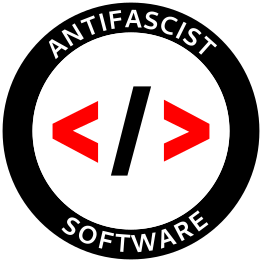
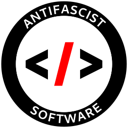

# Why

It shouldn't be this way, but it appears as if some projects are happy to show their neofascist affiliations.

This isn't really ideal now, is it?

# Download

You can download `2500x2500` png exports of the two logos here:

- [Red brackets version](https://github.com/callb4ck/antifascist-software-logo/releases/download/red-black-eng-2500x2500/red-brackets.png)
- [Black brackets version](https://github.com/callb4ck/antifascist-software-logo/releases/download/red-black-eng-2500x2500/black-brackets.png)

# Files

Files with the `.i.svg` extension are in the inkscape svg format.
Files with the `.svg` extension are plain svg (not 1.1 compatible).

- `original-proj.i.svg` is the original inkscape project.
- `no-fonts.i.svg` is the project without the use of font files, ready to be exported.
- `red-brackets.svg` and `black-brackets.svg` are svg exports of the project.

## Export

Files `red-brackets.svg` and `black-brackets.svg` are exported from the `no-fonts.i.svg` file.

